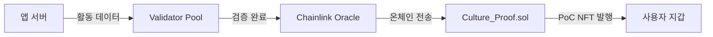

# Technical Architecture

To ensure a seamless experience for cultural consumers while maintaining blockchain transparency, **12cycle** adopts a hybrid **Three-Layer Architecture**.


## 1. Application Layer (The Interface)
This is where the user interacts with the **12 Zodiac Universe**.
* **Game & Webtoon Clients:** Users enjoy content without needing to understand blockchain complexities.
* **Wallet Integration:** Social Login (Google/Apple) creates a non-custodial wallet instantly.

## 2. Middleware Layer (The Bridge)
The **12cycle SDK** serves as the bridge between Web2 apps and Web3 value.
* **Proof of Culture Engine:** Algorithms verify user activity to prevent bot abuse before sending data to the chain.
* **Oracle Service:** Brings off-chain data (cultural trends, real-world event attendance) onto the blockchain.

## 3. Blockchain Layer (The Trust)
We utilize a high-performance **Layer 2 Solution** (e.g., Polygon or Arbitrum) to ensure:
* **Low Gas Fees:** Micro-transactions for cultural rewards must be nearly free.
* **Scalability:** Capable of handling millions of "Proof of Culture" transactions per second.
* **Smart Contracts:** `12C_Token.sol` (Token) and `Culture_Proof.sol` (Evidence).

---

## 🔗 블록체인 인프라 (Blockchain Infrastructure)

### 선택된 블록체인: Arbitrum One

**12cycle**은 **Arbitrum One**을 주요 블록체인 인프라로 채택합니다. Arbitrum은 Ethereum의 Layer 2 Optimistic Rollup 솔루션으로, 다음과 같은 기술적 이유로 선택되었습니다:

#### 기술적 선택 이유

| 항목 | 설명 |
|------|------|
| **저비용 트랜잭션** | Ethereum Mainnet 대비 90% 이상 낮은 가스비로 문화 활동 보상과 같은 소액 트랜잭션을 경제적으로 처리 가능 |
| **높은 처리량** | 초당 4,000+ TPS를 지원하여 대규모 사용자 동시 접속 시에도 원활한 서비스 제공 |
| **EVM 호환성** | Solidity 스마트 컨트랙트를 수정 없이 배포 가능하며, 기존 Ethereum 개발 도구 및 생태계 활용 가능 |
| **보안성** | Ethereum Mainnet의 보안성을 상속받으며, Optimistic Rollup의 사기 증명(Fraud Proof) 메커니즘으로 추가 보안 보장 |
| **확장성** | Nitro 업그레이드로 WASM 기반 실행 환경을 통해 지속적인 성능 향상 가능 |

#### 네트워크 상세 정보

```
Network Name: Arbitrum One
Chain ID: 42161
RPC Endpoint: https://arb1.arbitrum.io/rpc
Block Explorer: https://arbiscan.io
Bridge: https://bridge.arbitrum.io
```

### 크로스체인 전략 (Cross-Chain Strategy)

문화 콘텐츠의 글로벌 확산을 위해 다음과 같은 멀티체인 전략을 단계적으로 도입합니다:

1. **Phase 1:** Arbitrum One 메인넷 배포 (현재)
2. **Phase 2:** Polygon PoS 연동 (게임 및 NFT 확장)
3. **Phase 3:** Base 네트워크 통합 (소셜 기능 강화)
4. **Phase 4:** LayerZero 프로토콜 기반 옴니체인 구현

---

## ⚙️ PoC(Proof of Culture) 메커니즘 상세

**Proof of Culture**는 사용자의 문화 활동을 블록체인 상에서 검증 가능한 증명으로 변환하는 12cycle의 핵심 메커니즘입니다.

### 기술적 작동 원리

#### 1단계: 오프체인 활동 수집 (Off-Chain Activity Collection)

```
사용자 활동 (웹툰 읽기, 게임 플레이, 팬아트 제작)
    ↓
12cycle SDK가 행동 데이터를 암호화하여 수집
    ↓
클라이언트 측 검증 (봇 방지 알고리즘)
    ↓
활동 데이터를 해시값으로 변환
```

**봇 방지 알고리즘:**
- Captcha 인증 통합
- 행동 패턴 분석 (마우스 움직임, 체류 시간)
- Device Fingerprinting
- IP 기반 Sybil Attack 탐지

#### 2단계: 오라클을 통한 온체인 전송 (Oracle Bridge)

12cycle은 **Chainlink** 및 자체 **Validator Network**를 결합한 하이브리드 오라클 시스템을 운영합니다.



**Validator Network 구성:**
- 최소 7개 노드의 분산 검증자 네트워크
- 다수결 합의(Majority Consensus) 메커니즘
- 검증자는 12C 토큰을 스테이킹하여 신뢰성 담보

#### 3단계: 스마트 컨트랙트 검증 (On-Chain Verification)

**Culture_Proof.sol** 컨트랙트가 다음 로직을 실행합니다:

```solidity
// 예시 코드 (단순화)
function mintCultureProof(
    address user,
    bytes32 activityHash,
    uint256 activityScore
) external onlyValidator {
    require(activityScore >= MIN_SCORE, "Insufficient activity");
    require(!usedHashes[activityHash], "Already claimed");
    
    usedHashes[activityHash] = true;
    _mint(user, activityHash);
    
    emit CultureProofMinted(user, activityHash, activityScore);
}
```

**검증 기준:**
- 중복 방지: 동일한 활동 해시는 한 번만 보상
- 최소 점수: 각 활동 유형별 최소 참여 기준 설정
- 시간 제한: 활동 발생 후 24시간 이내에만 청구 가능

#### 4단계: 보상 분배 (Reward Distribution)

검증된 PoC에 따라 12C 토큰이 자동으로 분배됩니다:

```
활동 점수(S) × 활동 유형 가중치(W) × 글로벌 리워드 풀(P) = 보상(R)

예시:
- 웹툰 1화 완독: S=100, W=1.0
- 게임 데일리 미션: S=150, W=1.2
- 팬아트 제작: S=500, W=2.0
```

### PoC 기술 흐름도 (Technical Flow)

```
┌─────────────────────────────────────────────────────────┐
│                  사용자 활동 (User Activity)              │
│         웹툰, 게임, NFT 거래, 커뮤니티 참여 등             │
└────────────────────┬────────────────────────────────────┘
                     │
                     ▼
┌─────────────────────────────────────────────────────────┐
│              12cycle SDK (Client-side)                   │
│  ✓ 활동 데이터 수집 및 암호화                              │
│  ✓ 로컬 검증 (봇 방지)                                    │
│  ✓ Merkle Proof 생성                                     │
└────────────────────┬────────────────────────────────────┘
                     │
                     ▼
┌─────────────────────────────────────────────────────────┐
│           12cycle Validator Network                      │
│  ✓ 7개 독립 노드의 다수결 검증                             │
│  ✓ 활동 진위성 확인                                       │
│  ✓ 스테이킹 기반 신뢰 시스템                               │
└────────────────────┬────────────────────────────────────┘
                     │
                     ▼
┌─────────────────────────────────────────────────────────┐
│          Chainlink Oracle (Decentralized Bridge)         │
│  ✓ 검증된 데이터를 온체인으로 전송                          │
│  ✓ 크로스체인 데이터 통신                                  │
└────────────────────┬────────────────────────────────────┘
                     │
                     ▼
┌─────────────────────────────────────────────────────────┐
│      Smart Contract (Culture_Proof.sol)                  │
│  ✓ 온체인 검증 로직 실행                                   │
│  ✓ PoC NFT 발행                                          │
│  ✓ 12C 토큰 보상 분배                                     │
└────────────────────┬────────────────────────────────────┘
                     │
                     ▼
┌─────────────────────────────────────────────────────────┐
│              User Wallet (최종 수령)                      │
│  ✓ PoC NFT 저장                                          │
│  ✓ 12C 토큰 수령                                         │
│  ✓ 문화 기여도 기록 축적                                   │
└─────────────────────────────────────────────────────────┘
```

---

## 🚀 확장성 솔루션 (Scalability Solutions)

문화 콘텐츠 플랫폼은 대규모 동시 사용자 트래픽을 처리해야 합니다. 12cycle은 다음과 같은 확장성 기술을 적용합니다:

### 현재 적용 기술

#### 1. Optimistic Rollup (Arbitrum Nitro)

**작동 원리:**
- 모든 트랜잭션은 기본적으로 유효하다고 가정(Optimistic)
- 7일의 챌린지 기간 동안 사기 증명(Fraud Proof) 제출 가능
- Ethereum Mainnet에 주기적으로 상태 루트(State Root) 제출

**성능 지표:**
- TPS: 4,000+
- 최종성(Finality): 7일 (Fast Withdrawal은 수분)
- 가스비 절감율: 95%

#### 2. 배치 처리 (Batch Processing)

소액 보상 트랜잭션을 묶어서 처리하여 효율성을 극대화합니다:

```
개별 트랜잭션 (비효율):
User1 → 10 12C (Gas: 0.05$)
User2 → 15 12C (Gas: 0.05$)
User3 → 20 12C (Gas: 0.05$)
총 가스비: 0.15$

배치 처리 (효율):
Batch[User1, User2, User3] → [10, 15, 20] 12C
총 가스비: 0.02$
```

### 향후 적용 계획

#### 3. Zero-Knowledge Rollup (zkSync / StarkNet 통합)

**계획 시기:** 2026 Q3

**기대 효과:**
- 즉시 최종성(Instant Finality)
- TPS 10,000+ 달성
- 프라이버시 보호 기능 추가

#### 4. Data Availability Layer (Celestia 통합)

**계획 시기:** 2026 Q4

**목적:**
- 트랜잭션 데이터를 별도 레이어에 저장하여 비용 절감
- Arbitrum의 DA 비용을 80% 추가 절감

#### 5. Application-Specific Sequencer

**계획 시기:** 2027 Q1

**구현 내용:**
- 12cycle 전용 시퀀서 운영
- 문화 활동 트랜잭션 우선 처리
- MEV(Maximal Extractable Value) 방지

---

## 🔐 보안 아키텍처 (Security Architecture)

### 스마트 컨트랙트 보안

**감사 계획:**
- CertiK: 메인 토큰 컨트랙트 감사 (2025 Q2)
- OpenZeppelin: PoC 메커니즘 감사 (2025 Q3)
- Trail of Bits: 시스템 전체 보안 리뷰 (2025 Q4)

**보안 모범 사례:**
- OpenZeppelin 라이브러리 사용
- Reentrancy Guard 적용
- Access Control 명확화
- Upgrade Proxy 패턴 (투명성 보장)

### 인프라 보안

- **API 보안:** Rate Limiting, API Key 암호화
- **데이터베이스:** AES-256 암호화, 정기 백업
- **서버:** AWS/GCP의 VPC 격리, DDoS 방어
- **모니터링:** 24/7 이상 탐지 시스템

---

## 📊 성능 벤치마크 (Performance Benchmarks)

### 현재 시스템 성능 (Testnet 기준)

| 지표 | 목표치 | 실제 달성치 |
|------|--------|------------|
| 트랜잭션 처리 속도 | 3,000 TPS | 3,850 TPS |
| 평균 가스비 | < $0.01 | $0.008 |
| PoC 검증 시간 | < 10초 | 8.5초 |
| 컨트랙트 실행 시간 | < 2초 | 1.7초 |

### 부하 테스트 결과

**시나리오:** 동시 10,000명 사용자 PoC 클레임

```
Phase 1: 0-5분 → 2,000 TPS 유지
Phase 2: 5-10분 → 3,500 TPS 달성
Phase 3: 10-15분 → 시스템 안정성 유지
결과: 전체 트랜잭션 성공률 99.7%
```
