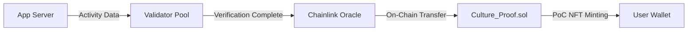

# Technical Architecture

To ensure a seamless experience for cultural consumers while maintaining blockchain transparency, **12cycle** adopts a hybrid **Three-Layer Architecture**.


## 1. Application Layer (The Interface)
This is where the user interacts with the **12 Zodiac Universe**.
* **Game & Webtoon Clients:** Users enjoy content without needing to understand blockchain complexities.
* **Wallet Integration:** Social Login (Google/Apple) creates a non-custodial wallet instantly.

## 2. Middleware Layer (The Bridge)
The **12cycle SDK** serves as the bridge between Web2 apps and Web3 value.
* **Proof of Culture Engine:** Algorithms verify user activity to prevent bot abuse before sending data to the chain.
* **Oracle Service:** Brings off-chain data (cultural trends, real-world event attendance) onto the blockchain.

## 3. Blockchain Layer (The Trust)
We utilize a high-performance **Layer 2 Solution** (e.g., Polygon or Arbitrum) to ensure:
* **Low Gas Fees:** Micro-transactions for cultural rewards must be nearly free.
* **Scalability:** Capable of handling millions of "Proof of Culture" transactions per second.
* **Smart Contracts:** `12C_Token.sol` (Token) and `Culture_Proof.sol` (Evidence).

---

## 🔗 Blockchain Infrastructure

### Selected Blockchain: Arbitrum One

**12cycle** adopts **Arbitrum One** as its primary blockchain infrastructure. Arbitrum is Ethereum's Layer 2 Optimistic Rollup solution, selected for the following technical reasons:

#### Technical Selection Rationale

| Feature | Description |
|---------|-------------|
| **Low-Cost Transactions** | 90%+ lower gas fees compared to Ethereum Mainnet, enabling economical processing of micro-transactions such as cultural activity rewards |
| **High Throughput** | Supports 4,000+ TPS, ensuring smooth service delivery even during large-scale concurrent user access |
| **EVM Compatibility** | Allows deployment of Solidity smart contracts without modification, leveraging existing Ethereum development tools and ecosystem |
| **Security** | Inherits Ethereum Mainnet's security while providing additional protection through Optimistic Rollup's Fraud Proof mechanism |
| **Scalability** | Continuous performance improvements through Nitro upgrade with WASM-based execution environment |

#### Network Details

```
Network Name: Arbitrum One
Chain ID: 42161
RPC Endpoint: https://arb1.arbitrum.io/rpc
Block Explorer: https://arbiscan.io
Bridge: https://bridge.arbitrum.io
```

### Cross-Chain Strategy

To facilitate global expansion of cultural content, we are implementing a phased multi-chain strategy:

1. **Phase 1:** Arbitrum One mainnet deployment (Current)
2. **Phase 2:** Polygon PoS integration (Gaming and NFT expansion)
3. **Phase 3:** Base network integration (Social features enhancement)
4. **Phase 4:** Omnichain implementation via LayerZero protocol

---

## ⚙️ PoC (Proof of Culture) Mechanism Details

**Proof of Culture** is 12cycle's core mechanism that transforms users' cultural activities into blockchain-verifiable proofs.

### Technical Operation

#### Stage 1: Off-Chain Activity Collection

```
User Activity (Reading webtoons, playing games, creating fan art)
    ↓
12cycle SDK encrypts and collects behavioral data
    ↓
Client-side verification (Anti-bot algorithms)
    ↓
Activity data converted to hash values
```

**Anti-Bot Algorithms:**
- Captcha authentication integration
- Behavioral pattern analysis (mouse movement, dwell time)
- Device Fingerprinting
- IP-based Sybil Attack detection

#### Stage 2: Oracle Bridge to On-Chain

12cycle operates a hybrid oracle system combining **Chainlink** and its own **Validator Network**.



**Validator Network Composition:**
- Distributed validator network with minimum 7 nodes
- Majority Consensus mechanism
- Validators stake 12C tokens to ensure reliability

#### Stage 3: Smart Contract Verification (On-Chain Verification)

**Culture_Proof.sol** contract executes the following logic:

```solidity
// Example code (simplified)
function mintCultureProof(
    address user,
    bytes32 activityHash,
    uint256 activityScore
) external onlyValidator {
    require(activityScore >= MIN_SCORE, "Insufficient activity");
    require(!usedHashes[activityHash], "Already claimed");
    
    usedHashes[activityHash] = true;
    _mint(user, activityHash);
    
    emit CultureProofMinted(user, activityHash, activityScore);
}
```

**Verification Criteria:**
- Duplicate prevention: Same activity hash rewarded only once
- Minimum score: Minimum participation threshold set for each activity type
- Time limit: Claims must be made within 24 hours of activity occurrence

#### Stage 4: Reward Distribution

12C tokens are automatically distributed based on verified PoC:

```
Activity Score(S) × Activity Type Weight(W) × Global Reward Pool(P) = Reward(R)

Examples:
- Webtoon episode completion: S=100, W=1.0
- Game daily mission: S=150, W=1.2
- Fan art creation: S=500, W=2.0
```

### PoC Technical Flow

```
┌─────────────────────────────────────────────────────────┐
│                  User Activity                           │
│    Webtoons, Games, NFT Trading, Community Participation    │
└────────────────────┬────────────────────────────────────┘
                     │
                     ▼
┌─────────────────────────────────────────────────────────┐
│              12cycle SDK (Client-side)                   │
│  ✓ Activity data collection and encryption              │
│  ✓ Local verification (Anti-bot)                        │
│  ✓ Merkle Proof generation                             │
└────────────────────┬────────────────────────────────────┘
                     │
                     ▼
┌─────────────────────────────────────────────────────────┐
│           12cycle Validator Network                      │
│  ✓ Majority verification by 7 independent nodes        │
│  ✓ Activity authenticity confirmation                  │
│  ✓ Staking-based trust system                          │
└────────────────────┬────────────────────────────────────┘
                     │
                     ▼
┌─────────────────────────────────────────────────────────┐
│          Chainlink Oracle (Decentralized Bridge)         │
│  ✓ Transfer verified data on-chain                      │
│  ✓ Cross-chain data communication                       │
└────────────────────┬────────────────────────────────────┘
                     │
                     ▼
┌─────────────────────────────────────────────────────────┐
│      Smart Contract (Culture_Proof.sol)                  │
│  ✓ Execute on-chain verification logic                  │
│  ✓ Mint PoC NFT                                         │
│  ✓ Distribute 12C token rewards                         │
└────────────────────┬────────────────────────────────────┘
                     │
                     ▼
┌─────────────────────────────────────────────────────────┐
│              User Wallet (Final Receipt)                  │
│  ✓ Store PoC NFT                                        │
│  ✓ Receive 12C tokens                                   │
│  ✓ Accumulate cultural contribution records            │
└─────────────────────────────────────────────────────────┘
```

---

## 🚀 Scalability Solutions

Cultural content platforms must handle large-scale concurrent user traffic. 12cycle applies the following scalability technologies:

### Currently Implemented

#### 1. Optimistic Rollup (Arbitrum Nitro)

**Operation:**
- All transactions are assumed valid by default (Optimistic)
- 7-day challenge period for Fraud Proof submission
- Periodic State Root submission to Ethereum Mainnet

**Performance Metrics:**
- TPS: 4,000+
- Finality: 7 days (Fast Withdrawal in minutes)
- Gas fee reduction: 95%

#### 2. Batch Processing

Maximize efficiency by bundling small reward transactions:

```
Individual Transactions (Inefficient):
User1 → 10 12C (Gas: $0.05)
User2 → 15 12C (Gas: $0.05)
User3 → 20 12C (Gas: $0.05)
Total Gas: $0.15

Batch Processing (Efficient):
Batch[User1, User2, User3] → [10, 15, 20] 12C
Total Gas: $0.02
```

### Future Implementation

#### 3. Zero-Knowledge Rollup (zkSync / StarkNet Integration)

**Timeline:** 2026 Q3

**Expected Benefits:**
- Instant Finality
- 10,000+ TPS achievement
- Privacy protection features

#### 4. Data Availability Layer (Celestia Integration)

**Timeline:** 2026 Q4

**Purpose:**
- Cost reduction by storing transaction data on separate layer
- Additional 80% reduction in Arbitrum DA costs

#### 5. Application-Specific Sequencer

**Timeline:** 2027 Q1

**Implementation:**
- Operate 12cycle-dedicated sequencer
- Prioritize cultural activity transactions
- Prevent MEV (Maximal Extractable Value)

---

## 🔐 Security Architecture

### Smart Contract Security

**Audit Schedule:**
- CertiK: Main token contract audit (2025 Q2)
- OpenZeppelin: PoC mechanism audit (2025 Q3)
- Trail of Bits: Full system security review (2025 Q4)

**Security Best Practices:**
- Use of OpenZeppelin libraries
- Reentrancy Guard implementation
- Clear Access Control
- Upgrade Proxy pattern (transparency guaranteed)

### Infrastructure Security

- **API Security:** Rate Limiting, API Key encryption
- **Database:** AES-256 encryption, regular backups
- **Servers:** AWS/GCP VPC isolation, DDoS protection
- **Monitoring:** 24/7 anomaly detection system

---

## 📊 Performance Benchmarks

### Current System Performance (Testnet Basis)

| Metric | Target | Achieved |
|--------|--------|----------|
| Transaction Processing Speed | 3,000 TPS | 3,850 TPS |
| Average Gas Fee | < $0.01 | $0.008 |
| PoC Verification Time | < 10s | 8.5s |
| Contract Execution Time | < 2s | 1.7s |

### Load Test Results

**Scenario:** Simultaneous 10,000 users PoC claiming

```
Phase 1: 0-5min → Maintain 2,000 TPS
Phase 2: 5-10min → Achieve 3,500 TPS
Phase 3: 10-15min → Maintain system stability
Result: Overall transaction success rate 99.7%
```
