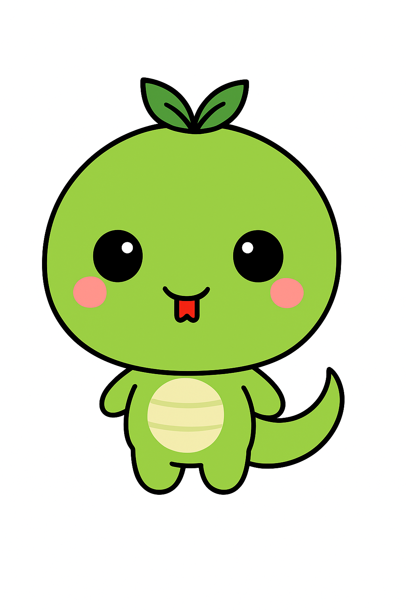
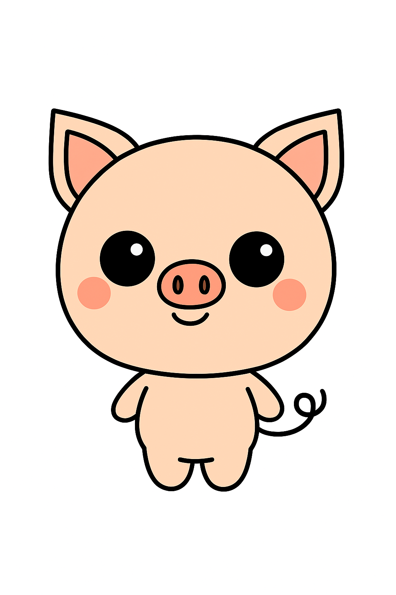

# Proof of Culture

The core mechanism of the 12cycle ecosystem is the **"Proof of Culture" (PoC)**. This mechanism transforms user engagement into tangible value.

## 🐉 The Power of 12 Zodiac Legends

**12cycle** is built upon the universal cultural heritage of the **12 Zodiac Animals (十二支)** — a mythology shared across East Asian cultures and recognized globally.

### The Origin Story

According to ancient legend, the Jade Emperor held a great race to determine which animals would represent the years in the calendar. The first 12 animals to cross the celestial river would earn their place in history. Through cleverness, strength, and determination, these animals became:

🐭 **Rat (子)** · 🐮 **Ox (丑)** · 🐯 **Tiger (寅)** · 🐰 **Rabbit (卯)**\
🐉 **Dragon (辰)** · 🐍 **Snake (巳)** · 🐴 **Horse (午)** · 🐑 **Sheep (未)**\
🐵 **Monkey (申)** · 🐔 **Rooster (酉)** · 🐶 **Dog (戌)** · 🐷 **Pig (亥)**

### Meet the 12 Heroes

|  
 Sheep <em>The Gentle Guardian</em>
  | 
 Monkey <em>The Clever Trickster</em>
 | 
 Rooster <em>The Dawn Herald</em>
 |   
 Dog <em>The Loyal Friend</em>
  |
| :----------------------------------------------------------------------------------------------------------------------: | :-------------------------------------------------------------------------------------------------------------------------: | :---------------------------------------------------------------------------------------------------------------------: | :---------------------------------------------------------------------------------------------------------------------: |
|   
 Pig <em>The Fortunate One</em>
  |   
 Rat <em>The Cunning Pioneer</em>
   | 
 Ox <em>The Steadfast Worker</em>
 | 
 Tiger <em>The Brave Warrior</em>
 |
| 
 Rabbit <em>The Swift Dreamer</em>
 |   
 Dragon <em>The Divine Ruler</em>
   |  
 Snake <em>The Wise Mystic</em>
  |  
 Horse <em>The Free Spirit</em>
  |

### A Shared Cultural Universe

The 12 Zodiac system is not confined to one nation—it is a **Pan-Asian cultural phenomenon**:

| Region           | Local Name     | Cultural Significance                                                       |
| ---------------- | -------------- | --------------------------------------------------------------------------- |
| 🇨🇳 **China**   | 生肖 (Shēngxiào) | Origin of the zodiac system, deeply integrated into festivals and astrology |
| 🇰🇷 **Korea**   | 십이지 (Sibiiji)  | Used in traditional calendars and fortune-telling                           |
| 🇯🇵 **Japan**   | 十二支 (Jūnishi)  | Featured in New Year celebrations and shrine decorations                    |
| 🇻🇳 **Vietnam** | 12 Con Giáp    | Similar system with cat replacing rabbit                                    |
| 🌏 **Global**    | Chinese Zodiac | Recognized worldwide through media, fashion, and pop culture                |

### Why This Matters for 12cycle

These 12 characters serve as the foundation for:

* **Cultural IP Expansion:** Each zodiac animal becomes a unique character with stories, games, and webtoons.
* **Cross-Cultural Appeal:** The zodiac system transcends language barriers, making it accessible to diverse audiences.
* **Infinite Scalability:** From rat to pig, each character can evolve into its own sub-universe.

## 🧬 How It Works

Unlike traditional platforms where user data is siloed, 12cycle verifies and rewards cultural activities across applications.

1. **Participation:** Users play 12cycle-IP games, read webtoons, or collect NFTs featuring the 12 zodiac characters.
2. **Verification:** The activity is verified on-chain as a "Cultural Transaction."
3. **Reward:** Users earn **12C tokens** as proof of their contribution to the cultural ecosystem.

> 💡 **Utility:** The earned 12C tokens act as a "Ticket" or "Passport" to access higher-tier content, exclusive merchandise, and governance rights within the DAO.

## 🎨 From Folklore to Digital Economy

The **12C token** is not just a currency — it's a **Cultural Certificate**. Every transaction represents:

* A user engaging with zodiac-themed content (games, stories, art)
* A creator producing new cultural works based on the 12 legends
* A community member voting on which character gets the next expansion

This creates a self-sustaining loop where **cultural consumption = economic value**.
