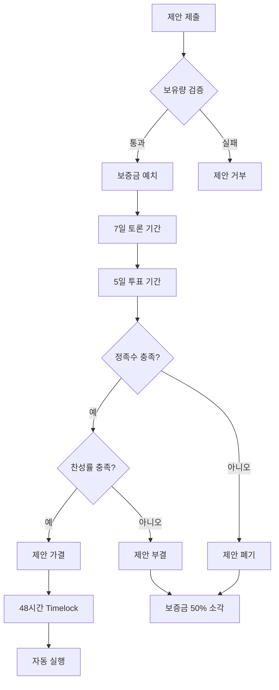

# The Grand Council (DAO)

**12cycle** is not owned by a corporation but governed by its community. The **Grand Council** is the decision-making body where **12C** token holders shape the future.

## 🏛️ Governance Structure

The voting power is derived from the **12C** tokens staked in the governance contract.

### 1. Proposal Phase (The Agenda)
Any holder with more than **120,000 12C** can submit a proposal regarding:
* **IP Expansion:** "Which animal/character should get a new skin or story arc?"
* **Ecosystem Grants:** "Which webtoon artist should receive funding?"

### 2. Voting Phase (The Voice)
* **1 Token = 1 Vote:** Simple majority rules.
* **Quorum:** A proposal needs at least 12% participation to be valid.

## 🛡️ Treasury Management
A portion of the ecosystem revenue is deposited into the **Community Treasury**. The Council votes on how to use these funds.

---

## ⚖️ DAO 투표 메커니즘 상세 (DAO Voting Mechanism)

### 투표권 가중치 기준 (Voting Weight Calculation)

**기본 원칙:** 1 12C = 1 Vote (스테이킹된 토큰만 계산)

**가중치 부스터 시스템:**

| 조건 | 가중치 배율 | 설명 |
|------|-----------|------|
| **일반 보유** | 1.0x | 기본 투표권 |
| **30일 스테이킹** | 1.2x | 단기 스테이커 |
| **90일 스테이킹** | 1.5x | 중기 스테이커 |
| **365일 스테이킹** | 2.0x | 장기 스테이커 |
| **Genesis NFT 보유** | +0.3x | 초기 지지자 보너스 |
| **PoC 레벨 10+** | +0.2x | 활동 기여자 |

**투표권 계산 공식:**

$$
V_{power} = T_{staked} \\times (1 + B_{duration} + B_{NFT} + B_{PoC})
$$

- $V_{power}$: 총 투표권
- $T_{staked}$: 스테이킹된 토큰 양
- $B_{duration}$: 스테이킹 기간 보너스 (0 ~ 1.0)
- $B_{NFT}$: Genesis NFT 보너스 (0 or 0.3)
- $B_{PoC}$: PoC 레벨 보너스 (0 ~ 0.2)

**예시:**

```
사용자 A:
- 스테이킹: 1,000,000 12C (365일)
- Genesis NFT: 보유
- PoC 레벨: 15

투표권 = 1,000,000 × (1 + 1.0 + 0.3 + 0.2) = 2,500,000 Votes
```

### 제안 유형 및 조건 (Proposal Types)

#### 1. 일반 제안 (Standard Proposal)

**제출 조건:**
- 최소 보유: 120,000 12C (스테이킹 상태)
- 제안 보증금: 10,000 12C (가결 시 반환, 부결 시 소각)

**적용 분야:**
- 커뮤니티 이벤트 개최
- 마케팅 캠페인 승인
- 신규 파트너십 제안

**통과 조건:**
- 정족수: 12%
- 찬성률: 51%

#### 2. 중요 제안 (Major Proposal)

**제출 조건:**
- 최소 보유: 500,000 12C
- 제안 보증금: 50,000 12C

**적용 분야:**
- 생태계 펀드 사용 (100K 이상)
- 새로운 블록체인 확장
- IP 라이선싱 계약 승인

**통과 조건:**
- 정족수: 20%
- 찬성률: 66%

#### 3. 핵심 제안 (Critical Proposal)

**제출 조건:**
- 최소 보유: 1,200,000 12C (총 공급의 0.01%)
- 제안 보증금: 100,000 12C
- 5명 이상의 공동 제안자 필요

**적용 분야:**
- 스마트 컨트랙트 업그레이드
- 토큰 이코노미 변경
- 거버넌스 규칙 개정

**통과 조건:**
- 정족수: 30%
- 찬성률: 75%

### 투표 프로세스 상세 (Voting Process)



**기간 설정:**

| 단계 | 기간 | 설명 |
|------|------|------|
| **제안 검토** | 24시간 | 악의적 제안 필터링 |
| **토론 기간** | 7일 | 커뮤니티 의견 수렴 |
| **투표 기간** | 5일 | 실제 투표 진행 |
| **Timelock** | 48시간 | 긴급 거부권 행사 가능 |
| **실행** | 즉시 | 스마트 컨트랙트 자동 실행 |

### 최소 정족수 (Quorum Requirements)

**동적 정족수 시스템:**

현재 스테이킹 비율에 따라 정족수가 자동 조정됩니다:

$$
Q_{required} = Q_{base} \\times \\left( \\frac{S_{current}}{S_{target}} \\right)^{0.5}
$$

- $Q_{required}$: 요구 정족수
- $Q_{base}$: 기본 정족수 (12%)
- $S_{current}$: 현재 스테이킹 비율
- $S_{target}$: 목표 스테이킹 비율 (30%)

**예시:**

```
스테이킹 비율 50% 시:
Q = 12% × (50/30)^0.5 = 15.5%

스테이킹 비율 20% 시:
Q = 12% × (20/30)^0.5 = 9.8%
```

---

## 💼 Treasury 관리 (Treasury Management)

### Treasury 구성 (Treasury Composition)

**자금 출처:**

| 출처 | 비율 | 연간 예상 (Year 2) |
|------|------|------------------|
| NFT 거래 수수료 | 40% | $600K |
| IP 라이선싱 수익 | 30% | $450K |
| 게임 IAP | 20% | $300K |
| 기타 수익 | 10% | $150K |
| **총계** | **100%** | **$1.5M** |

### 자금 사용 우선순위 (Fund Allocation Priority)

**Tier 1 (필수 지출 - 자동 승인):**
- 스마트 컨트랙트 감사
- 인프라 유지비
- 법률 자문

**Tier 2 (일반 지출 - 일반 제안):**
- 마케팅 캠페인
- 커뮤니티 이벤트
- 크리에이터 지원금

**Tier 3 (전략적 투자 - 중요 제안):**
- 신규 블록체인 확장
- 대규모 파트너십
- M&A 및 투자

### 멀티시그 지갑 (Multi-Signature Wallet)

**서명자 구성:**

```
총 7명의 서명자 (5/7 승인 필요)

- 팀 대표: 2명
- DAO 선출 위원: 3명
- 독립 감사인: 2명

임기: 1년 (재선 가능)
```

**주요 지갑 주소 (Testnet):**

```
DAO Treasury: 0x1234...abcd
Emergency Fund: 0x5678...efgh
Marketing Fund: 0x9abc...ijkl
```

### 투명성 보고 (Transparency Reporting)

**분기별 재무 리포트:**
- 총 수입 및 지출 내역
- 주요 거래 내역 (> $10K)
- 다음 분기 예산 계획
- 커뮤니티 Q&A 세션

**실시간 대시보드:**
- Treasury 잔고 실시간 조회
- 최근 30일 거래 내역
- 제안별 집행 현황

---

## 🔐 긴급 거버넌스 메커니즘 (Emergency Governance)

### 긴급 정지 (Emergency Pause)

**활성화 조건:**
- 스마트 컨트랙트 취약점 발견
- 대규모 해킹 시도 탐지
- 극심한 시장 조작 의심

**실행 권한:**
- 5/7 멀티시그 서명 필요
- 최대 72시간 동안 유효
- DAO 투표로 연장 가능

### 거버넌스 업그레이드 경로 (Governance Evolution)

**Phase 1 (현재): 하이브리드 거버넌스**
- 팀이 기술적 결정 주도
- 커뮤니티가 전략적 결정 주도

**Phase 2 (Year 2): 커뮤니티 주도**
- 모든 중요 결정 DAO 투표
- 팀은 기술 자문 역할

**Phase 3 (Year 3+): 완전 탈중앙화**
- 온체인 거버넌스 100%
- 익명 제안자 지원
- 위임 투표(Delegation) 도입

---

## 🏆 거버넌스 인센티브 (Governance Incentives)

### 투표 참여 보상

**활동별 보상:**

| 활동 | 보상 (12C) | 조건 |
|------|-----------|------|
| **제안 제출** | 1,000 | 정족수 도달 시 |
| **투표 참여** | 50 | 각 투표당 |
| **토론 참여** | 10-100 | 품질 평가 기반 |
| **위원회 활동** | 월 10,000 | 선출된 DAO 위원 |

### DAO 위원 선출 (Council Election)

**선출 과정:**
- 연 2회 선거 (6월, 12월)
- 후보자 공약 발표 기간: 2주
- 투표 기간: 1주
- 상위 3명 당선

**위원 역할:**
- Treasury 멀티시그 서명자
- 긴급 제안 우선 검토
- 커뮤니티 대표 역할

**보상:**
- 월 급여: 10,000 12C
- 분기 성과금: 최대 30,000 12C
- Genesis NFT 에어드랍

---

## 📋 거버넌스 로드맵 (Governance Roadmap)

| 시기 | 마일스톤 | 상태 |
|------|----------|------|
| **2025 Q2** | DAO 스마트 컨트랙트 배포 | ✅ |
| **2025 Q3** | 첫 커뮤니티 제안 투표 | 🔄 진행 중 |
| **2025 Q4** | DAO 위원 1기 선출 | 📅 예정 |
| **2026 Q1** | 위임 투표 시스템 도입 | 📅 예정 |
| **2026 Q2** | 크로스체인 거버넌스 확장 | 🔮 계획 |
