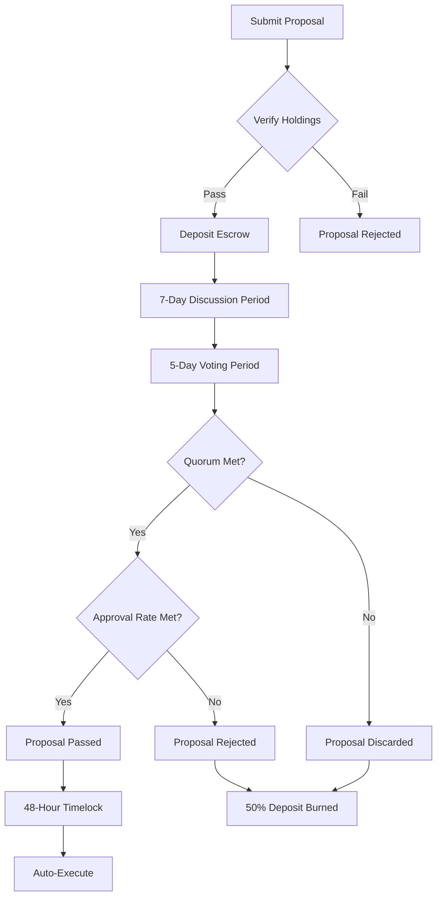

# The Grand Council (DAO)

**12cycle** is not owned by a corporation but governed by its community. The **Grand Council** is the decision-making body where **12C** token holders shape the future.

## 🏛️ Governance Structure

The voting power is derived from the **12C** tokens staked in the governance contract.

### 1. Proposal Phase (The Agenda)
Any holder with more than **120,000 12C** can submit a proposal regarding:
* **IP Expansion:** "Which animal/character should get a new skin or story arc?"
* **Ecosystem Grants:** "Which webtoon artist should receive funding?"

### 2. Voting Phase (The Voice)
* **1 Token = 1 Vote:** Simple majority rules.
* **Quorum:** A proposal needs at least 12% participation to be valid.

## 🛡️ Treasury Management
A portion of the ecosystem revenue is deposited into the **Community Treasury**. The Council votes on how to use these funds.

---

## ⚖️ DAO Voting Mechanism Details

### Voting Weight Calculation

**Core Principle:** 1 12C = 1 Vote (only staked tokens count)

**Weight Multiplier System:**

| Condition | Weight Multiplier | Description |
|------|-----------|------|\n| **Standard Holding** | 1.0x | Base voting power |
| **일반 보유** | 1.0x | 기본 투표권 |
| **30-Day Staking** | 1.2x | Short-term staker |
| **90-Day Staking** | 1.5x | Medium-term staker |
| **365-Day Staking** | 2.0x | Long-term staker |
| **Genesis NFT Holder** | +0.3x | Early supporter bonus |
| **PoC Level 10+** | +0.2x | Active contributor |

**투표권 계산 공식:**

$$
V_{power} = T_{staked} \\times (1 + B_{duration} + B_{NFT} + B_{PoC})
$$

- $V_{power}$: Total voting power
- $T_{staked}$: Amount of staked tokens
- $B_{duration}$: Staking duration bonus (0 ~ 1.0)
- $B_{NFT}$: Genesis NFT bonus (0 or 0.3)
- $B_{PoC}$: PoC level bonus (0 ~ 0.2)

**Example:**

```
User A:
- Staking: 1,000,000 12C (365 days)
- Genesis NFT: Holding
- PoC Level: 15

Voting Power = 1,000,000 × (1 + 1.0 + 0.3 + 0.2) = 2,500,000 Votes
```

### Proposal Types and Requirements

#### 1. Standard Proposal

**Submission Requirements:**
- Minimum holding: 120,000 12C (staked)
- Proposal deposit: 10,000 12C (returned if passed, burned if rejected)

**Applicable Areas:**
- Community event hosting
- Marketing campaign approval
- New partnership proposals

**Passage Conditions:**
- Quorum: 12%
- Approval rate: 51%

#### 2. Major Proposal

**Submission Requirements:**
- Minimum holding: 500,000 12C
- Proposal deposit: 50,000 12C

**Applicable Areas:**
- Ecosystem fund usage (>$100K)
- New blockchain expansion
- IP licensing contract approval

**Passage Conditions:**
- Quorum: 20%
- Approval rate: 66%

#### 3. Critical Proposal

**Submission Requirements:**
- Minimum holding: 1,200,000 12C (0.01% of total supply)
- Proposal deposit: 100,000 12C
- Requires 5+ co-proposers

**Applicable Areas:**
- Smart contract upgrades
- Token economics changes
- Governance rule amendments

**Passage Conditions:**
- Quorum: 30%
- Approval rate: 75%

### Detailed Voting Process



**Timeline:**

| Stage | Duration | Description |
|------|------|------|
| **Proposal Review** | 24 hours | Filter malicious proposals |
| **Discussion Period** | 7 days | Community feedback collection |
| **Voting Period** | 5 days | Actual voting execution |
| **Timelock** | 48 hours | Emergency veto window |
| **Execution** | Immediate | Smart contract auto-execution |

### 최소 정족수 (Quorum Requirements)

**동적 정족수 시스템:**

현재 스테이킹 비율에 따라 정족수가 자동 조정됩니다:

$$
Q_{required} = Q_{base} \\times \\left( \\frac{S_{current}}{S_{target}} \\right)^{0.5}
$$

- $Q_{required}$: 요구 정족수
- $Q_{base}$: 기본 정족수 (12%)
- $S_{current}$: 현재 스테이킹 비율
- $S_{target}$: 목표 스테이킹 비율 (30%)

**예시:**

```
스테이킹 비율 50% 시:
Q = 12% × (50/30)^0.5 = 15.5%

스테이킹 비율 20% 시:
Q = 12% × (20/30)^0.5 = 9.8%
```

---

## 💼 Treasury 관리 (Treasury Management)

### Treasury 구성 (Treasury Composition)

**자금 출처:**

| 출처 | 비율 | 연간 예상 (Year 2) |
|------|------|------------------|
| NFT 거래 수수료 | 40% | $600K |
| IP 라이선싱 수익 | 30% | $450K |
| 게임 IAP | 20% | $300K |
| 기타 수익 | 10% | $150K |
| **총계** | **100%** | **$1.5M** |

### 자금 사용 우선순위 (Fund Allocation Priority)

**Tier 1 (필수 지출 - 자동 승인):**
- 스마트 컨트랙트 감사
- 인프라 유지비
- 법률 자문

**Tier 2 (일반 지출 - 일반 제안):**
- 마케팅 캠페인
- 커뮤니티 이벤트
- 크리에이터 지원금

**Tier 3 (전략적 투자 - 중요 제안):**
- 신규 블록체인 확장
- 대규모 파트너십
- M&A 및 투자

### 멀티시그 지갑 (Multi-Signature Wallet)

**서명자 구성:**

```
총 7명의 서명자 (5/7 승인 필요)

- 팀 대표: 2명
- DAO 선출 위원: 3명
- 독립 감사인: 2명

임기: 1년 (재선 가능)
```

**주요 지갑 주소 (Testnet):**

```
DAO Treasury: 0x1234...abcd
Emergency Fund: 0x5678...efgh
Marketing Fund: 0x9abc...ijkl
```

### 투명성 보고 (Transparency Reporting)

**분기별 재무 리포트:**
- 총 수입 및 지출 내역
- 주요 거래 내역 (> $10K)
- 다음 분기 예산 계획
- 커뮤니티 Q&A 세션

**실시간 대시보드:**
- Treasury 잔고 실시간 조회
- 최근 30일 거래 내역
- 제안별 집행 현황

---

## 🔐 Emergency Governance Mechanisms

### Emergency Pause

**Activation Conditions:**
- Smart contract vulnerability discovered
- Large-scale hacking attempt detected
- Suspected severe market manipulation

**Execution Authority:**
- Requires 5/7 multi-sig signatures
- Valid for maximum 72 hours
- Extendable via DAO vote

### Governance Evolution Roadmap

**Phase 1 (Current): Hybrid Governance**
- Team leads technical decisions
- Community leads strategic decisions

**Phase 2 (Year 2): Community-Led**
- All major decisions via DAO vote
- Team serves as technical advisors

**Phase 3 (Year 3+): Full Decentralization**
- 100% on-chain governance
- Anonymous proposer support
- Delegation voting implementation

---

## 🏆 Governance Incentives

### Voting Participation Rewards

**Rewards by Activity:**

| Activity | Reward (12C) | Conditions |
|------|-----------|------|
| **Submit Proposal** | 1,000 | If quorum reached |
| **Vote Participation** | 50 | Per vote |
| **Discussion Contribution** | 10-100 | Quality-based assessment |
| **Council Member Activity** | 10,000 monthly | Elected DAO members |

### DAO Council Elections

**Election Process:**
- Biannual elections (June, December)
- Candidate platform announcement period: 2 weeks
- Voting period: 1 week
- Top 3 candidates elected

**Council Member Roles:**
- Treasury multi-sig signer
- Priority review of urgent proposals
- Community representative duties

**Compensation:**
- Monthly salary: 10,000 12C
- Quarterly performance bonus: up to 30,000 12C
- Genesis NFT airdrops

---

## 📋 Governance Roadmap

| Timeline | Milestone | Status |
|------|----------|------|
| **2025 Q2** | DAO smart contract deployment | ✅ |
| **2025 Q3** | First community proposal vote | 🔄 In Progress |
| **2025 Q4** | 1st Council election | 📅 Scheduled |
| **2026 Q1** | Delegation voting system launch | 📅 Scheduled |
| **2026 Q2** | Cross-chain governance expansion | 🔮 Planned |
