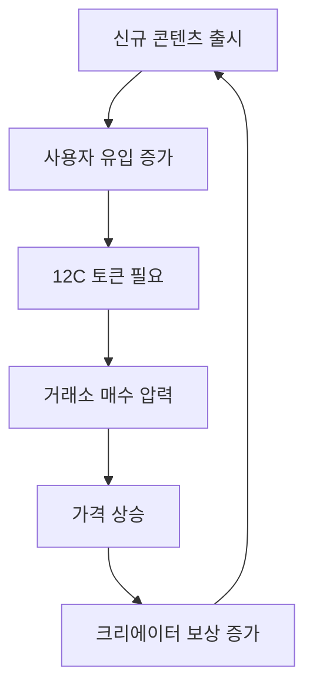

# Allocation & Vesting

The **12cycle (12C)** token economy is designed to ensure long-term sustainability and value circulation. The number **12** is symbolic and central to our mathematical modeling.

## 📊 Token Overview

| Feature              | Detail                                      |
| -------------------- | ------------------------------------------- |
| **Token Name**       | 12cycle                                     |
| **Symbol**           | 12C                                         |
| **Total Supply**     | 12,000,000,000 12C                          |
| **Network**          | Arbitrum One (Primary), Multi-chain Support |
| **Token Standard**   | ERC-20                                      |
| **Contract Address** | TBA (Testnet 배포 완료)                         |

## 🥧 Distribution

| Category                | Percentage | Amount (12C)  | Description                                  |
| ----------------------- | ---------- | ------------- | -------------------------------------------- |
| **Ecosystem & Rewards** | **40%**    | 4,800,000,000 | Rewards for "Proof of Culture" participants. |
| **Development**         | **20%**    | 2,400,000,000 | Platform development and IP creation.        |
| **Marketing**           | **15%**    | 1,800,000,000 | Global partnerships and brand awareness.     |
| **Team**                | **10%**    | 1,200,000,000 | Core contributors (Subject to vesting).      |
| **Reserve**             | **10%**    | 1,200,000,000 | Emergency funds and liquidity provision.     |
| **Public/Private Sale** | **5%**     | 600,000,000   | Initial fundraising.                         |

***

## 🎯 토큰 유틸리티 모델 (Token Utility Model)

**12C 토큰**은 단순한 결제 수단을 넘어, 12cycle 생태계 내에서 다양한 기능을 수행하는 **멀티 유틸리티 토큰**입니다.

### 1. 획득 (Earn) - 문화 기여에 대한 보상

#### 웹툰 (Webtoon) 영역

| 활동           | 보상 (12C)      | 조건              |
| ------------ | ------------- | --------------- |
| **웹툰 1화 완독** | 10-50 12C     | 최소 5분 이상 체류     |
| **댓글 작성**    | 5-20 12C      | 50자 이상, 일 3회 제한 |
| **별점 평가**    | 3 12C         | 에피소드당 1회        |
| **공유하기**     | 15 12C        | 소셜미디어 인증 필요     |
| **팬아트 제작**   | 100-1,000 12C | 커뮤니티 투표로 등급 결정  |
| **번역 기여**    | 500-2,000 12C | 검증자 승인 필요       |

#### 게임 (Game) 영역

| 활동          | 보상 (12C)         | 조건           |
| ----------- | ---------------- | ------------ |
| **데일리 로그인** | 5 12C            | 연속 출석 보너스 추가 |
| **미션 완료**   | 20-100 12C       | 난이도별 차등 지급   |
| **PvP 승리**  | 50 12C           | 시즌 랭킹 추가 보상  |
| **길드 활동**   | 30 12C           | 주간 기여도 평가    |
| **토너먼트 우승** | 5,000-50,000 12C | 월간/분기별 개최    |

#### NFT 수집품 (Collectibles) 영역

| 활동           | 보상 (12C)      | 조건            |
| ------------ | ------------- | ------------- |
| **첫 NFT 구매** | 100 12C       | 신규 사용자 웰컴 보너스 |
| **컬렉션 완성**   | 500-5,000 12C | 시리즈별 상이       |
| **NFT 스테이킹** | 연 5-15% APY   | 희귀도별 수익률 차등   |
| **2차 거래 판매** | 거래액의 1%       | 로열티 수익 공유     |

### 2. 소비 (Spend) - 생태계 내 활용

#### 콘텐츠 소비

```
프리미엄 웹툰 에피소드 해금: 50-200 12C
게임 아이템 구매: 10-1,000 12C
스킨/코스튬 구매: 100-500 12C
```

#### NFT 거래

```
마켓플레이스 수수료 (2.5%): 12C로 결제 시 50% 할인
NFT 민팅 비용: 기본 100 12C
프리미엄 리스팅: 50 12C (72시간 메인 노출)
```

#### 거버넌스 참여

```
DAO 제안 제출: 최소 120,000 12C 보유
투표권: 1 12C = 1 Vote
제안 부스팅: 1,000 12C (커뮤니티 노출 증가)
```

### 3. 스테이킹 (Stake) - 장기 보유 인센티브

#### 스테이킹 풀 구조

| 풀 종류         | 락업 기간 | APY | 추가 혜택             |
| ------------ | ----- | --- | ----------------- |
| **유연 풀**     | 없음    | 3%  | 언제든 인출 가능         |
| **30일 풀**    | 30일   | 8%  | 프리미엄 콘텐츠 조기 접근    |
| **90일 풀**    | 90일   | 15% | NFT 에어드랍 참여       |
| **365일 풀**   | 365일  | 25% | 거버넌스 투표권 2배       |
| **Zodiac 풀** | 12개월  | 30% | 한정판 Zodiac NFT 보장 |

#### 스테이킹 보상 공식

$$
R_{stake} = P \times \frac{APY}{365} \times D \times (1 + B_{multiplier})
$$

* $R\_{stake}$: 스테이킹 보상
* $P$: 스테이킹된 원금
* $APY$: 연간 수익률
* $D$: 스테이킹 일수
* $B\_{multiplier}$: 보너스 배율 (VIP 등급별)

***

## 💎 토큰 경제 심층 분석

### 토큰 유통 속도 (Velocity) 관리

토큰 가치의 안정성을 위해 유통 속도를 최적화합니다:

$$
V = \frac{GDP}{M}
$$

* $V$: 토큰 유통 속도
* $GDP$: 생태계 내 총 거래액
* $M$: 유통 중인 토큰 공급량

**목표 속도:** 3-5 (건강한 생태계 지표)

**속도 감소 전략:**

1. 스테이킹 인센티브 강화 (공급 잠금)
2. 장기 보유자 VIP 혜택
3. 베스팅을 통한 점진적 공급 증가

### 토큰 수요 창출 메커니즘

#### 지속적 수요 유도



#### 수요 다각화

1. **B2B 수요:** 기업의 IP 라이선싱 수수료
2. **B2C 수요:** 사용자의 콘텐츠/NFT 구매
3. **투기적 수요:** 스테이킹 및 장기 보유
4. **거버넌스 수요:** DAO 참여를 위한 보유
