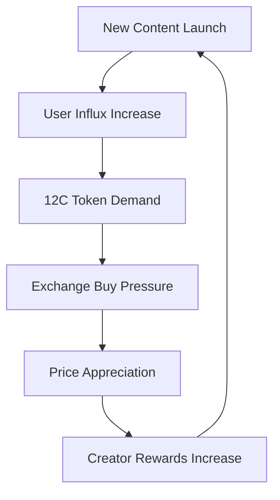

# Allocation & Vesting

The **12cycle (12C)** token economy is designed to ensure long-term sustainability and value circulation. The number **12** is symbolic and central to our mathematical modeling.

## 📊 Token Overview

| Feature | Detail |
| :--- | :--- |
| **Token Name** | 12cycle |
| **Symbol** | 12C |
| **Total Supply** | 12,000,000,000 12C |
| **Network** | Arbitrum One (Primary), Multi-chain Support |
| **Token Standard** | ERC-20 |
| **Contract Address** | TBA (Testnet Deployment Complete) |

## 🥧 Distribution


| Category | Percentage | Amount (12C) | Description |
| :--- | :--- | :--- | :--- |
| **Ecosystem & Rewards** | **40%** | 4,800,000,000 | Rewards for "Proof of Culture" participants. |
| **Development** | **20%** | 2,400,000,000 | Platform development and IP creation. |
| **Marketing** | **15%** | 1,800,000,000 | Global partnerships and brand awareness. |
| **Team** | **10%** | 1,200,000,000 | Core contributors (Subject to vesting). |
| **Reserve** | **10%** | 1,200,000,000 | Emergency funds and liquidity provision. |
| **Public/Private Sale** | **5%** | 600,000,000 | Initial fundraising. |

---

## 🎯 Token Utility Model

**12C token** is a **multi-utility token** that performs various functions within the 12cycle ecosystem, extending far beyond a simple payment method.

### 1. Earn - Rewards for Cultural Contribution

#### Webtoon Ecosystem

| Activity | Reward (12C) | Conditions |
|------|-----------|------|
| **Complete Episode** | 10-50 12C | Minimum 5 minutes engagement |
| **Write Comment** | 5-20 12C | 50+ characters, 3 per day limit |
| **Rate Episode** | 3 12C | Once per episode |
| **Share Content** | 15 12C | Social media verification required |
| **Create Fan Art** | 100-1,000 12C | Community voting determines tier |
| **Translation Contribution** | 500-2,000 12C | Validator approval required |

#### Gaming Ecosystem

| Activity | Reward (12C) | Conditions |
|------|-----------|------|
| **Daily Login** | 5 12C | Consecutive login bonus |
| **Complete Mission** | 20-100 12C | Difficulty-based rewards |
| **PvP Victory** | 50 12C | Season ranking bonus |
| **Guild Activity** | 30 12C | Weekly contribution assessment |
| **Tournament Victory** | 5,000-50,000 12C | Monthly/quarterly events |

#### NFT Collectibles Ecosystem

| Activity | Reward (12C) | Conditions |
|------|-----------|------|
| **First NFT Purchase** | 100 12C | New user welcome bonus |
| **Complete Collection** | 500-5,000 12C | Varies by series |
| **NFT Staking** | 5-15% APY | Rarity-based yields |
| **Secondary Market Sale** | 1% of transaction | Royalty revenue sharing |

### 2. Spend - Ecosystem Utilization

#### Content Consumption

```
Unlock Premium Webtoon Episodes: 50-200 12C
Purchase Game Items: 10-1,000 12C
Acquire Skins/Costumes: 100-500 12C
```

#### NFT Trading

```
Marketplace Fee (2.5%): 50% discount when paid with 12C
NFT Minting Cost: 100 12C base
Premium Listing: 50 12C (72-hour main page exposure)
```

#### Governance Participation

```
DAO Proposal Submission: Minimum 120,000 12C holdings
Voting Rights: 1 12C = 1 Vote
Proposal Boosting: 1,000 12C (increased community visibility)
```

### 3. Stake - Long-term Holding Incentives

#### Staking Pool Structure

| Pool Type | Lock Period | APY | Additional Benefits |
|---------|----------|-----|----------|
| **Flexible Pool** | None | 3% | Withdraw anytime |
| **30-Day Pool** | 30 days | 8% | Early access to premium content |
| **90-Day Pool** | 90 days | 15% | NFT airdrop eligibility |
| **365-Day Pool** | 365 days | 25% | 2x governance voting power |
| **Zodiac Pool** | 12 months | 30% | Guaranteed limited Zodiac NFT |

#### Staking Rewards Formula

$$
R_{stake} = P \times \frac{APY}{365} \times D \times (1 + B_{multiplier})
$$

- $R_{stake}$: Staking rewards
- $P$: Principal amount staked
- $APY$: Annual Percentage Yield
- $D$: Number of days staked
- $B_{multiplier}$: Bonus multiplier (VIP tier-based)

---

## 💎 Token Economics Deep Analysis

### Token Velocity Management

Optimizing circulation velocity for token value stability:

$$
V = \frac{GDP}{M}
$$

- $V$: Token velocity
- $GDP$: Total transaction volume within ecosystem
- $M$: Circulating token supply

**Target Velocity:** 3-5 (healthy ecosystem indicator)

**Velocity Reduction Strategies:**
1. Enhanced staking incentives (supply lock)
2. VIP benefits for long-term holders
3. Gradual supply increase through vesting

### Token Demand Generation Mechanisms

#### Sustained Demand Creation



#### Demand Diversification

1. **B2B Demand:** Corporate IP licensing fees
2. **B2C Demand:** User content/NFT purchases
3. **Speculative Demand:** Staking and long-term holding
4. **Governance Demand:** Holdings for DAO participation
